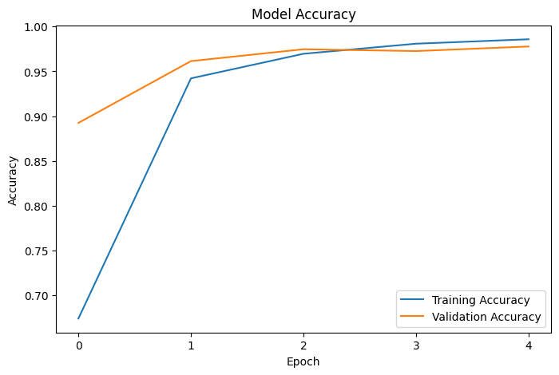
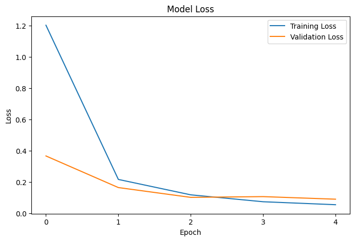
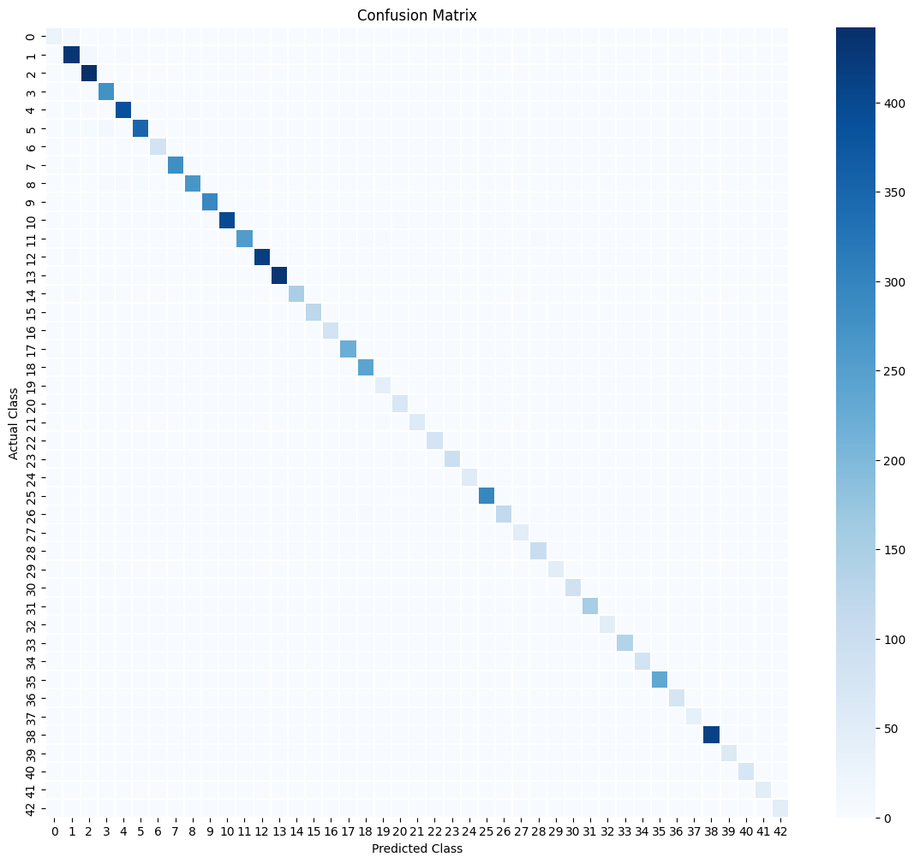

<div align="center">

# 🚦 Traffic Sign Classifier

**A CNN that learned to read the road — trained on 43 traffic sign classes from the GTSRB dataset**

[](https://python.org)
[](https://tensorflow.org)
[](https://opencv.org)
[](https://jupyter.org)

<br>

### .☘︎ ݁˖ 97.78% validation accuracy

*built as a personal deep dive into computer vision — my first real CNN from scratch*

</div>

---

## results 

<table>
  <tr>
    <td align="center"><b>Accuracy</b></td>
    <td align="center"><b>Loss</b></td>
    <td align="center"><b>Confusion Matrix</b></td>
  </tr>
  <tr>
    <td></td>
    <td></td>
    <td></td>
  </tr>
</table>

---

## what this project does

A full computer vision pipeline that classifies traffic signs into **43 categories** using a Convolutional Neural Network trained on the [German Traffic Sign Recognition Benchmark (GTSRB)](https://www.kaggle.com/datasets/meowmeowmeowmeowmeow/gtsrb-german-traffic-sign) dataset.

The model handles everything from raw image preprocessing to final prediction — no pretrained backbone, just a CNN built and trained from scratch.

---

## model architecture

```
Input (32×32×3)
    ↓
Conv2D → MaxPooling
    ↓
Conv2D → MaxPooling
    ↓
Flatten
    ↓
Dense → Dense
    ↓
Softmax Output (43 classes)
```

| parameter | value |
|---|---|
| input size | 32 × 32 × 3 |
| output classes | 43 |
| framework | TensorFlow / Keras |
| validation accuracy | **97.78%** |

---

## ☁ how to run it

**1. clone the repo**
```bash
git clone https://github.com/khy1ii/traffic-sign-classifier.git
cd traffic-sign-classifier
```

**2. install dependencies**
```bash
pip install -r requirements.txt
```

**3. download the dataset**

Get the GTSRB dataset from Kaggle → [link here](https://www.kaggle.com/datasets/meowmeowmeowmeowmeow/gtsrb-german-traffic-sign) and place it in the project root.

**4. run the notebook**
```bash
jupyter notebook traffic_sign_classifier.ipynb
```

> ۶ৎ if you just want to see the model in action without retraining, the saved model `traffic_model.h5` is already included in the repo — you can load it directly with `tf.keras.models.load_model('traffic_model.h5')`

---

## workflow

```
load dataset (CSV metadata + images)
        ↓
exploratory data analysis
        ↓
image preprocessing with OpenCV
(resize to 32×32, normalize pixel values)
        ↓
convert to NumPy arrays
        ↓
train/validation split
        ↓
train CNN with TensorFlow/Keras
        ↓
evaluate → accuracy graph, loss graph, confusion matrix
```

---

## tech stack

| library | what it's used for |
|---|---|
| `TensorFlow / Keras` | building and training the CNN |
| `OpenCV` | image loading and preprocessing |
| `NumPy` | array operations and data handling |
| `Pandas` | loading and managing dataset metadata |
| `Matplotlib / Seaborn` | visualizing accuracy, loss, and confusion matrix |
| `Scikit-learn` | train/test split and evaluation metrics |

---

## what i learned building this

- how CNNs actually learn spatial features through convolution layers
- why normalization matters — raw pixel values made training unstable until normalized
- reading a confusion matrix to spot which sign classes the model struggles with
- the full pipeline from raw images to a saved `.h5` model file

---

## what's next

- [ ] real-time webcam prediction
- [ ] data augmentation to improve robustness
- [ ] experiment with transfer learning 
- [ ] deploy as a Streamlit web app
- [ ] extend to a full detection pipeline 

---

## project structure

```
traffic-sign-classifier/
├── images/                    # result graphs and visualizations
│   ├── accuracy.png
│   ├── loss.png
│   └── confusion_matrix.png
├── traffic_sign_classifier.ipynb   # main notebook
├── traffic_model.h5               # saved trained model
├── requirements.txt               # dependencies
└── README.md
```

---

<div align="center">
  <sub>made by <a href="https://github.com/khy1ii">khy1ii</a> · feel free to read, star, or reach out!</sub>
</div>
